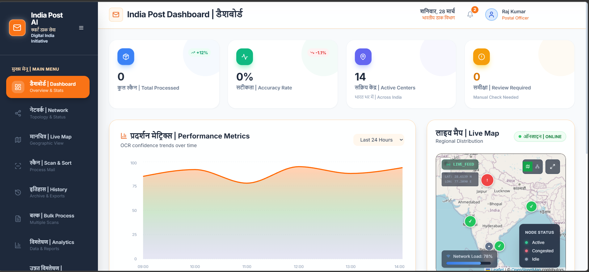
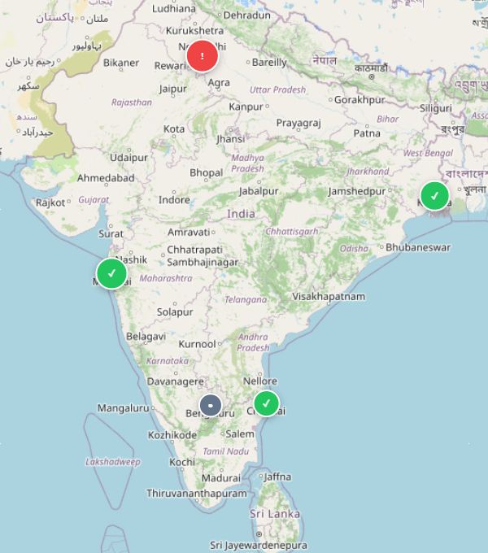

# SmartMailSorter

SmartMailSorter is an AI-powered web application for intelligent mail scanning, sorting insights, and operational visualization.

This project was built for a hackathon challenge inspired by Indian Post workflows.

## Project Snapshot

- Scan mail images and extract address data using AI providers
- Track sorting performance with dashboards and analytics
- Visualize routes and center activity with network and map views
- Manage history, filters, and CSV-based data workflows

## Screenshots






## Quick Start

1. Install dependencies:

   ```bash
   npm install
   ```

2. Run the app:

   ```bash
   npm run dev
   ```

3. Open:

   ```
   http://localhost:5173
   ```

## Configuration

Create `.env.local` and configure the keys you need:

- `VITE_SUPABASE_URL`
- `VITE_SUPABASE_KEY`
- `GOOGLE_API_KEY` (optional)
- `HF_API_KEY` (optional)

## More Details

For full documentation, feature walkthroughs, and advanced usage, see:

- [README_DETAILED.md](./README_DETAILED.md)
